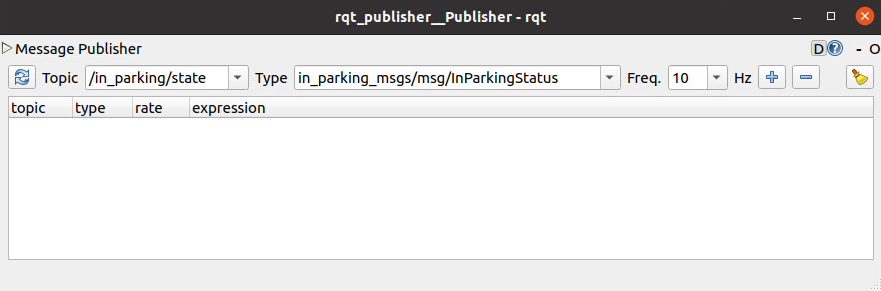
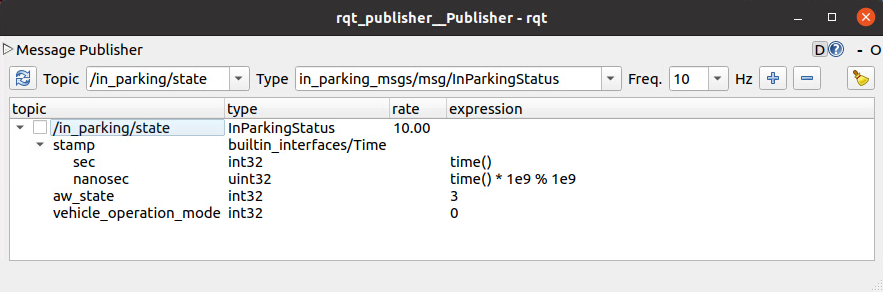

# Cargo Loading Service Test

## Description

The following aspects are tested.

|Check Point No.|Description|
|---|---|
|1|The service `/in_parking/task` returns success or failure as the response value.|
|2|Service behavior changes depending on the value of `aw_state` received at `/in_parking/state`.|
|3|Service behavior changes depending on the value of `states` received in `/v2i/infrastructure_states`.|
|4|Service behavior changes depending on the value of `id` received in `/v2i/infrastructure_states`.|


## Test coverage

The correspondence between the test objects and the point of view is as follows.

|Test Target No.|Test Target|Check Point No.|
|---|---|---|
|1 | Return SUCCESS(=1)                               |1|
|2 | Return FAIL(=2)                                  |1|
|3 | aw_state is NONE(=0)                             |2|
|4 | aw_state is AW_EMERGENCY(=1)                     |2|
|5 | aw_state is AW_OUT_OF_PARKING(=2)                |2|
|6 | aw_state is AW_ARRIVED_PARKING(=3)               |2|
|7 | aw_state is AW_INVALID_DEPARTURE_INSTRUCTION(=4) |2|
|8 | aw_state is AW_WAIT_DEPARTURE_INSTRUCTION(=5)    |2|
|9 | aw_state is AW_UNAVAILABLE(=6)                   |2|
|10| state is 0b01                                    |3|
|11| state is not 0b01                                |3|
|12| Match with ID requested by service               |4|
|13| Mismatch with ID requested by service            |4|

## Preliminary Preparation

In the test procedure, rqt_publisher is used for topic distribution in /in_parking/state.
In this section, we make preliminary preparations for using rqt_publisher.

1. Start the GUI with the following command.

   ```sh
   # Terminal
   ros2 run rqt_publisher rqt_publisher
   ```

1. Set the following parameters in the launched GUI.  

   |Parameter|Value|
   |---|---|
   |Topic|/in_parking/state|
   |Type|in_parking_msgs/msg/InParkingStatus|
   |Freq.|10|

   

1. After setting these parameters, press the "+" button.

1. Set the following parameters in the added /in_parking/state.

   |Parameter|Value|
   |---|---|
   |stamp.sec|time()|
   |stamp.nanosec|time() * 1e9 % 1e9|

   

1. Check the box next to /in_parking/state.

## Common test procedure

Before this procedure, rqt_publisher must have been executed according to the [Preliminary Preparation](#preliminary-preparation).

### Step.1

Set the following parameters in /in_parking/state in rqt_publisher.
|Parameter|Value|
|---|---|
|aw_state|3|
|vehicle_operation_mode|1|

```sh
# Terminal-1
# The log output level is changed to DEBUG in some places.
ros2 run cargo_loading_service cargo_loading_service --ros-args --log-level debug
```

```sh
# Terminal-2
ros2 topic echo /cargo_loading/infrastructure_commands
```

```sh
# Terminal-3
ros2 service call /in_parking/task in_parking_msgs/srv/ExecuteInParkingTask "{id: '200'}"
```

```sh
# Terminal-4
ros2 topic pub --once /v2i/infrastructure_states v2i_interface_msgs/msg/InfrastructureStateArray "{stamp: {sec: 1, nanosec: 1}, states: [{stamp: {sec: 1, nanosec: 1}, id: '200', state: 1}]}"
```

### Step.2

Set the following parameters in /in_parking/state in rqt_publisher.
|Parameter|Value|
|---|---|
|aw_state|0|
|vehicle_operation_mode|1|

```sh
# Terminal-3
ros2 service call /in_parking/task in_parking_msgs/srv/ExecuteInParkingTask "{id: '200'}"
```

### Step.3

Set the following parameters in /in_parking/state in rqt_publisher.
|Parameter|Value|
|---|---|
|aw_state|4|
|vehicle_operation_mode|1|

```sh
# Terminal-3
ros2 service call /in_parking/task in_parking_msgs/srv/ExecuteInParkingTask "{id: '200'}"
```

### Step.4

Set the following parameters in /in_parking/state in rqt_publisher.
|Parameter|Value|
|---|---|
|aw_state|5|
|vehicle_operation_mode|1|

### Step.5

Set the following parameters in /in_parking/state in rqt_publisher.
|Parameter|Value|
|---|---|
|aw_state|2|
|vehicle_operation_mode|1|

### Step.6

Set the following parameters in /in_parking/state in rqt_publisher.
|Parameter|Value|
|---|---|
|aw_state|3|
|vehicle_operation_mode|1|

```sh
# Terminal-3
ros2 service call /in_parking/task in_parking_msgs/srv/ExecuteInParkingTask "{id: '200'}"
```

Set the following parameters in /in_parking/state in rqt_publisher.
|Parameter|Value|
|---|---|
|aw_state|6|
|vehicle_operation_mode|1|

### Step.7

Set the following parameters in /in_parking/state in rqt_publisher.
|Parameter|Value|
|---|---|
|aw_state|3|
|vehicle_operation_mode|1|

```sh
# Terminal-3
ros2 service call /in_parking/task in_parking_msgs/srv/ExecuteInParkingTask "{id: '200'}"
```

```sh
# Terminal-4
ros2 topic pub --once /v2i/infrastructure_states v2i_interface_msgs/msg/InfrastructureStateArray "{stamp: {sec: 1, nanosec: 1}, states: [{stamp: {sec: 1, nanosec: 1}, id: '200', state: '0'}]}"
```

```sh
# Terminal-4
ros2 topic pub --once /v2i/infrastructure_states v2i_interface_msgs/msg/InfrastructureStateArray "{stamp: {sec: 1, nanosec: 1}, states: [{stamp: {sec: 1, nanosec: 1}, id: '201', state: '1'}]}"
```

### Step.8

Set the following parameters in /in_parking/state in rqt_publisher.
|Parameter|Value|
|---|---|
|aw_state|1|
|vehicle_operation_mode|1|

```sh
# Terminal-4
ros2 topic pub --once /v2i/infrastructure_states v2i_interface_msgs/msg/InfrastructureStateArray "{stamp: {sec: 1, nanosec: 1}, states: [{stamp: {sec: 1, nanosec: 1}, id: '200', state: '1'}]}"
```

### Test procedure and criteria details

#### Test procedure and criteria details of target No.1

**After Step 1**

- Expectation
  - `/in_parking/task`
    - Returns a successful response to a service request.
      - The state of the response message must be 1.

```sh
# Terminal-3
requester: making request: in_parking_msgs.srv.ExecuteInParkingTask_Request(id=200)

response:
in_parking_msgs.srv.ExecuteInParkingTask_Response(state=1)

```

#### Test procedure and criteria details of target No.2

**After Step 2**

- Expectation
  - `/in_parking/task`
    - Returns a failure response to a service request.
      - The state of the response message must be 2.

```sh
# Terminal-3
requester: making request: in_parking_msgs.srv.ExecuteInParkingTask_Request(id=200)

response:
in_parking_msgs.srv.ExecuteInParkingTask_Response(state=2)

```

#### Test procedure and criteria details of target No.3

**After Step 2**

- Expectation
  - `/cargo_loading/infrastructure_commands`
    - A message with a state of 254 must be continuously published.
    - Stopping publishing after 2 seconds.
  - `/in_parking/task`
    - Returns a successful response to a service request.
      - The state of the response message must be 2.

```sh
# Terminal-2
stamp:
  sec: 1681276164
  nanosec: 449616332
commands:
- stamp:
    sec: 1681276164
    nanosec: 449616332
  id: 200
  state: 254
---
stamp:
  sec: 1681276164
  nanosec: 649786969
commands:
- stamp:
    sec: 1681276164
    nanosec: 649786969
  id: 200
  state: 254
---
```

```sh
# Terminal-3
requester: making request: in_parking_msgs.srv.ExecuteInParkingTask_Request(id=200)

response:
in_parking_msgs.srv.ExecuteInParkingTask_Response(state=2)

```

#### Test procedure and criteria details of target No.4

**After Step 8**

- Expectation
  - `/cargo_loading/infrastructure_commands`
    - A message with a state of 2 must be continuously published.

```sh
# Terminal-2
stamp:
  sec: 1681278262
  nanosec: 108299942
commands:
- stamp:
    sec: 1681278262
    nanosec: 108299942
  id: 200
  state: 2
---
stamp:
  sec: 1681278262
  nanosec: 308352491
commands:
- stamp:
    sec: 1681278262
    nanosec: 308352491
  id: 200
  state: 2
---
```

#### Test procedure and criteria details of target No.5

**After Step 5**

- Expectation
  - `/cargo_loading/infrastructure_commands`
    - A message with a state of 254 must be continuously published.
    - Stopping publishing after 2 seconds.
  - `/in_parking/task`
    - Returns a successful response to a service request.
      - The state of the response message must be 2.

```sh
# Terminal-2
stamp:
  sec: 1681276874
  nanosec: 545080865
commands:
- stamp:
    sec: 1681276874
    nanosec: 545080865
  id: 200
  state: 254
---
stamp:
  sec: 1681276874
  nanosec: 745257601
commands:
- stamp:
    sec: 1681276874
    nanosec: 745257601
  id: 200
  state: 254
---
```

```sh
# Terminal-3
requester: making request: in_parking_msgs.srv.ExecuteInParkingTask_Request(id=200)

response:
in_parking_msgs.srv.ExecuteInParkingTask_Response(state=2)

```

#### Test procedure and criteria details of target No.6

**After Step 1**

- Expectation
  - `/cargo_loading/infrastructure_commands`
    - A message with a state of 1 must be continuously published.

```sh
# Terminal-2
stamp:
  sec: 1681277299
  nanosec: 535766464
commands:
- stamp:
    sec: 1681277299
    nanosec: 535766464
  id: 200
  state: 1
---
stamp:
  sec: 1681277299
  nanosec: 735726301
commands:
- stamp:
    sec: 1681277299
    nanosec: 735726301
  id: 200
  state: 1
---
```

#### Test procedure and criteria details of target No.7

**After Step 3**

- Expectation
  - `/cargo_loading/infrastructure_commands`
    - A message with a state of 1 must be continuously published.

```sh
# Terminal-2
stamp:
  sec: 1681276502
  nanosec: 51933267
commands:
- stamp:
    sec: 1681276502
    nanosec: 51933267
  id: 200
  state: 1
---
stamp:
  sec: 1681276502
  nanosec: 251926652
commands:
- stamp:
    sec: 1681276502
    nanosec: 251926652
  id: 200
  state: 1
---
```

#### Test procedure and criteria details of target No.8

**After Step 4**

- Expectation
  - `/cargo_loading/infrastructure_commands`
    - A message with a state of 1 must be continuously published.

```sh
# Terminal-2
stamp:
  sec: 1681276793
  nanosec: 651938579
commands:
- stamp:
    sec: 1681276793
    nanosec: 651938579
  id: 200
  state: 1
---
stamp:
  sec: 1681276793
  nanosec: 851930749
commands:
- stamp:
    sec: 1681276793
    nanosec: 851930749
  id: 200
  state: 1
---
```

#### Test procedure and criteria details of target No.9

**After Step 6**

- Expectation
  - `/cargo_loading/infrastructure_commands`
    - A message with a state of 254 must be continuously published.
    - Stopping publishing after 2 seconds.
  - `/in_parking/task`
    - Returns a successful response to a service request.
      - The state of the response message must be 2.

```sh
# Terminal-2
stamp:
  sec: 1681277407
  nanosec: 937613894
commands:
- stamp:
    sec: 1681277407
    nanosec: 937613894
  id: 200
  state: 254
---
stamp:
  sec: 1681277408
  nanosec: 137813955
commands:
- stamp:
    sec: 1681277408
    nanosec: 137813955
  id: 200
  state: 254
---
```

```sh
# Terminal-3
requester: making request: in_parking_msgs.srv.ExecuteInParkingTask_Request(id=200)

response:
in_parking_msgs.srv.ExecuteInParkingTask_Response(state=2)

```

#### Test procedure and criteria details of target No.10

**After Step 1**

- Expectation
  - `/cargo_loading/infrastructure_commands`
    - A message with a state of 254 must be continuously published.
    - Stopping publishing after 2 seconds.
  - `/in_parking/task`
    - Returns a successful response to a service request.
      - The state of the response message must be 1.

```sh
# Terminal-2
stamp:
  sec: 1681277648
  nanosec: 414284097
commands:
- stamp:
    sec: 1681277648
    nanosec: 414284097
  id: 200
  state: 1
---
stamp:
  sec: 1681277648
  nanosec: 614329113
commands:
- stamp:
    sec: 1681277648
    nanosec: 614329113
  id: 200
  state: 254
---
```

```sh
# Terminal-3
requester: making request: in_parking_msgs.srv.ExecuteInParkingTask_Request(id=200)

response:
in_parking_msgs.srv.ExecuteInParkingTask_Response(state=1)

```

#### Test procedure and criteria details of target No.11

**After Step 7**

- Expectation
  - `/cargo_loading/infrastructure_commands`
    - The state of the message being published should not change.
  - `/in_parking/task`
    - Not returning service requests.

```sh
# Terminal-2
stamp:
  sec: 1681277987
  nanosec: 988062538
commands:
- stamp:
    sec: 1681277987
    nanosec: 988062538
  id: 200
  state: 1
---
stamp:
  sec: 1681277988
  nanosec: 188054889
commands:
- stamp:
    sec: 1681277988
    nanosec: 188054889
  id: 200
  state: 1
---
```

```sh
# Terminal-3
requester: making request: in_parking_msgs.srv.ExecuteInParkingTask_Request(id=200)

```

#### Test procedure and criteria details of target No.12

**After Step 1**

- Expectation
  - `/cargo_loading/infrastructure_commands`
    - A message with a state of 254 must be continuously published.
    - Stopping publishing after 2 seconds.
  - `/in_parking/task`
    - Returns a successful response to a service request.
      - The state of the response message must be 1.

```sh
# Terminal-2
stamp:
  sec: 1681277648
  nanosec: 414284097
commands:
- stamp:
    sec: 1681277648
    nanosec: 414284097
  id: 200
  state: 1
---
stamp:
  sec: 1681277648
  nanosec: 614329113
commands:
- stamp:
    sec: 1681277648
    nanosec: 614329113
  id: 200
  state: 254
---
```

```sh
# Terminal-3
requester: making request: in_parking_msgs.srv.ExecuteInParkingTask_Request(id=200)

response:
in_parking_msgs.srv.ExecuteInParkingTask_Response(state=1)

```

#### Test procedure and criteria details of target No.13

**After Step 7**

- Expectation
  - `/cargo_loading/infrastructure_commands`
    - The state of the message being published should not change.
  - `/in_parking/task`
    - Not returning service requests.

```sh
# Terminal-2
stamp:
  sec: 1681277987
  nanosec: 988062538
commands:
- stamp:
    sec: 1681277987
    nanosec: 988062538
  id: 200
  state: 1
---
stamp:
  sec: 1681277988
  nanosec: 188054889
commands:
- stamp:
    sec: 1681277988
    nanosec: 188054889
  id: 200
  state: 1
---
```

```sh
# Terminal-3
requester: making request: in_parking_msgs.srv.ExecuteInParkingTask_Request(id=200)

```
